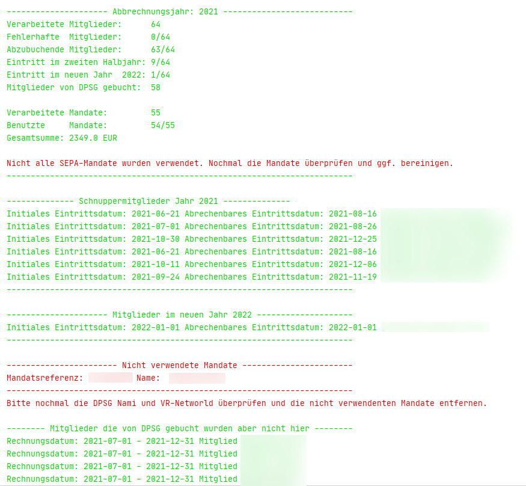
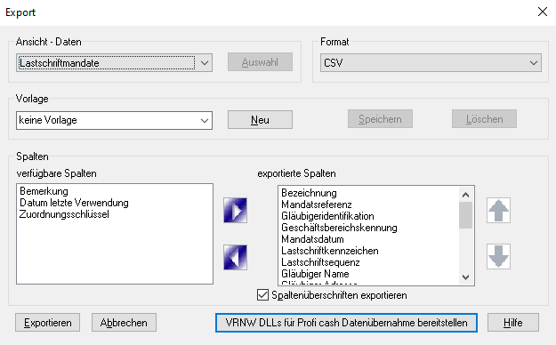

# README
Dieses kleine Python Skript wwandelt die Daten der Nami automatisch um und konvertiert diese in eine exportierbare *.csv Datei, welche dann im VR-Networld Tool importiert werden kann. Dabei werden die Daten von der Nami direkt über die API heruntergeladen. Deshalb müssen auch der Benutzername und das Passwort für die Nami im Skript hinterlegt werden.
Zurzeit ist nur eine jährliche Abrechnung am Ende des Jahres vorgesehen.

Folgende Features werden zurzeit unterstützt:
- Automatisches Generieren der SEPA-Lastschriftaufträge im korrekten Format für VR-Networld
- Überprüfung von korrektem Mapping der SEPA-Mandate und der Nami Mitglieder
- Korrekte Behandlung vom Beitragsatz (familienermäßigt, sozialermäßigt)
- Korrekte Behandlung von Mitgliedern die unterjährig eingestiegen sind
- Korrekte Behandlung von Schnuppermitgliedern und deren korrektes Eintrittsdatum für die Abrechnung
- Automatisches Generieren des Verwendungszweckes mit Mitgliedsnamen und Abrechnungsjahr Angabe
- Möglichkeit die Beiträge pro Jahr, oder pro Halbjahr zu berechnen
- Überprüfung auf korrekte IBAN und BIC

# Requirements
Folgende Dinge werden benötigt, damit das Skripot funktioniert:
- Python 3.6 oder höher (getestet wurde mit 3.9)
- Idealerweise liegt Python in den Pfadvariablen. Alternativ kann auch ein venv erzeugt werden
- pynami Package für den API Zugriff (https://pynami.readthedocs.io/en/latest/installation.html und https://github.com/sscholz93/pynami)
- Alle packages aus dem requirements.txt. Dazu eine Powershell im Repository root Ordner öffnen und folgenden Befehl ausführen: 
*pip install -r requirements.txt* 
- Passwort und Benutzername in der *config.ini* Datei anpassen
- Restlicher Parameter in der *config.ini* anpassen

# Usage
Damit der Export problemlos funktioniert, ist es wichtig, dass die Nami Datenbank gepflegt und aktuell ist. Die Nami Datenbank stellt dabei den Master dar und gibt auch die Kontodaten vor. Einzig die Mandate werden im VR-Networld neu angelegt. Das Skript versucht dann für jede Person ein passendes Mandat zu finden.

- Nami pflegen und alle Benutzer entsprechend eintragen. Alle Kontodaten aktualisieren. Alle Schnuppermitgliedschaften pflegen
- Anlegen aller SEPA-Mandate von neuen Mitgliedern in VR-Networld. Zurzeit ist ein Mandat pro Kontoinhaber vorgesehen.
- Exportieren der SEPA-Mandate über *VR Symbol -> Export*: 
- Daten in der config.ini Datei entsprechend anpassen. Eine Beschreibung der Parameter findet ihr unten.
- Skript ausführen. Dazu eine powershell im Repository Ordner öffnen und folgenden Befehl ausführen: *python main.py*

Das Skript lädt nun automatisch alle aktiven Nutzer der Nami runter und gleich diese mit den Mandaten ab. Die Statistik zum Schluss gibt Aufschluss darüber, ober etwas schief gegangen ist.
Folgende Dinge werden am Ende des Skripts angezeigt:
- Schnuppermitglieder, die im Abrechnungsjahr hinzugefügt wurden, jetzt aber schon aktive Mitglieder sind (8 Wochen Schnupperzeit ist abgelaufen).
- Mitglieder die im zweiten Halbjahr des Abrechnungsjahres beitragspflichtig eingetragen wurden (Darunter zählen auch Schnuppermitglieder, deren Überführung zu einem beitragspflichtigen Mitglied im zweiten Halbjahr geschah).
- Mitglieder die im Folgejahr des Abrechnungsjahres eingetragen wurden. Diese werden für die Abrechnung nicht berücksichtigt.
- Mitglieder für die kein passendes SEPA-Mandat gefunden wurde.
- Liste von SEPA-Mandaten die nicht verwendet wurden. Dies gibt Aufschluss darüber, ob Karteileichen in VR-Networld existieren.

Es wurde nun im Repository Ordner eine *MitgliederAbrechnung_JJJJ.csv* Datei erstellt. Diese Datei kann nun verwendet werden, um automatisch alle Lastschrifteinzüge in VR-Networld zu erstellen.
- In VR-Networld die generierte Abrechnungsdatei importieren. Dazu *VR Symbol -> Import Aufträge -> MitgliederAbrechnung_JJJJ.csv*
- Im Dialog nun *erste importierte Zeile ist die Spaltenüberschrift?* anklicken. Das Mapping der Spalten zu den Inhalten sollte nun automatisch funktionieren und richtig sein. Die ersten drei Felder stehen auf *\<nicht importiern\>*. Diese Felder sind die Mitgliedsnummer, sowie der Vor- und Nachname. Diese Felder werden für die Importierung nicht benötigt. Alternativ kann auch die Vorlage *ImportFromPythoNScript.ini* verwendet werden. Dazu muss diese nach *C:\Users\Public\Documents\VR-NetWorld\Vorlagen* kopiert werden. Die Felder BLZ und KontoNr müssen dann mit dem Vereinskonto noch ausgefüllt werden

- *OK* klicken. Es werden nun alle Lastschrifteinzüge automatisch im Ausgangskorb angelegt.

# Zu beachtende Dinge
- Bei Mitglieder mit Schnuppermitgliedschaft muss diese an erster Stelle in der Tätigkeitenliste stehen. Ansonsten geht der Check schief, wann das genaue Eintrittsdatum des Mitglieds ist.
- Enddatum der Schnuppermitgliedschaft nicht korrekt. Dadurch kann das Abholen der Aktivitäten fehlschlagen
*Mitglied ...: Enddatum scheint für die Schnuppermitgliedschaft nicht zu stimmen. {1: {'entries_aktivBis': ['Not a valid date.']}}*
Dies kann zum Beispiel vorkommen, wenn das Datum der Schnuppermitgliedschaft 8 Wochen überschreitet, oder eine zeitliche Lücke zwischen Schnuppermitgliedschaftsende und Berechenbares Mitglied Anfang besteht.
Die Abzurechnende Mitgliedschaft muss immer einen Tag nachdem die Schnuppermitgliedschaft beendet wurde beginnen.

# Config.ini
tbd

# Kommende Featureliste
- Unterstützung der Abrechnung am Jahresanfang, zweimal im Jahr, oder zu einem gegebenen Stichtag.
- Abgleich der Abrechnung mit der Abrechnung von der DPSG
- Einfaches Handling von Mitgliedern die unterjährig ausgestiegen sind und die der Datenweiterverarbeitung nicht zugestimmt haben
- Automatisches Mapping der Mandate zu den Mitgliedern über die Mitgliedernummer
- Automatisches Anlegen der SEPA-Mandate bei neuen Mitgliedern
