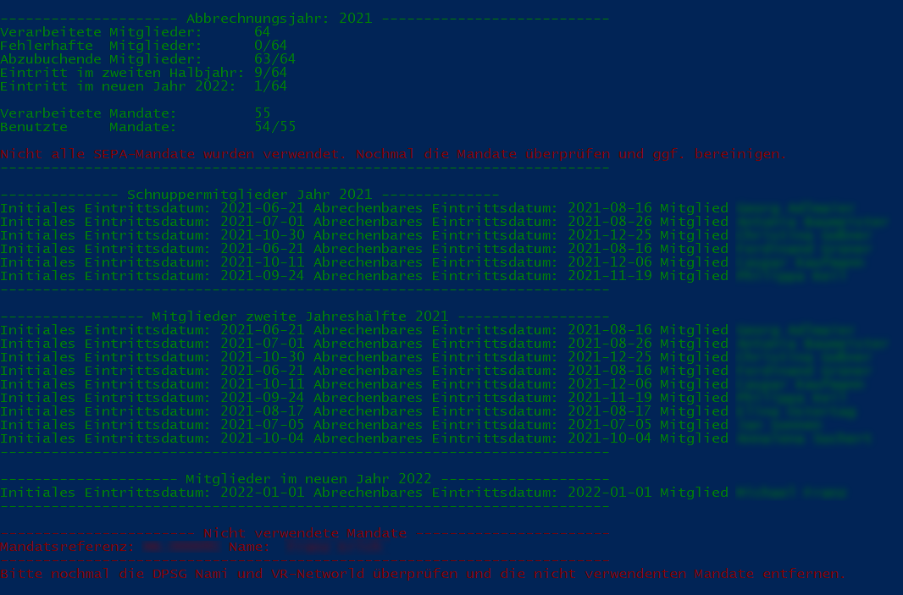

# README
Dieses kleine Python Skript wwandelt die Daten der Nami automatisch um und konvertiert diese in eine exportierbare *.csv Datei, welche dann im VR-Networld Tool importiert werden kann. Dabei werden die Daten von der Nami direkt über die API heruntergeladen. Deshalb müssen auch der Benutzername und das Passwort für die Nami im Skript hinterlegt werden.
Zurzeit ist nur eine jährliche Abrechnung am Ende des Jahres vorgesehen.

Folgende Features werden zurzeit unterstützt:
- Automatisches Generieren der SEPA-Lastschriftaufträge im korrekten Format für VR-Networld
- Überprüfung von korrektem Mapping der SEPA-Mandate und der Nami Mitglieder
- Korrekte Behandlung von Mitgliedern die unterjährig eingestiegen sind
- Korrekte Behandlung von Schnuppermitgliedern und deren korrektes Eintrittsdatum für die Abrechnung
- Automatisches Generieren des Verwendungszweckes mit Mitgliedsnamen und Abrechnungsjahr Angabe
- Möglichkeit die Beiträge pro Jahr, oder pro Halbjahr zu berechnen

# Requirements
Folgende Dinge werden benötigt, damit das Skripot funktioniert:
- Python 3.6 oder höher (getestet wurde mit 3.9)
- Idealerweise liegt Python in den Pfadvariablen. Alternativ kann auch ein venv erzeugt werden
- pynami Package für den API Zugriff (https://pynami.readthedocs.io/en/latest/installation.html und https://github.com/sscholz93/pynami)
- Alle packages aus dem requirements.txt. Dazu eine Powershell im Repository root Ordner öffnen und folgenden Befehl ausführen: 
*pip install -r requirements.txt* 
- Passwort und Benutzername in der *config.ini* Datei anpassen
- Restlicher Parameter in der *config.ini* anpassen

# Usage
Damit der Export problemlos funktioniert, ist es wichtig, dass die Nami Datenbank gepflegt und aktuell ist. Die Nami Datenbank stellt dabei den Master dar und gibt auch die Kontodaten vor. Einzig die Mandate werden im VR-Networld neu angelegt. Das Skript versucht dann für jede Person ein passendes Mandat zu finden.

# Zu beachtende Dinge
- Bei Mitglieder mit Schnuppermitgliedschaft muss diese an erster Stelle in der Tätigkeitenliste stehen. Ansonsten geht der Check schief, wann das genaue Eintrittsdatum des Mitglieds ist.
- Enddatum der Schnuppermitgliedschaft nicht korrekt. Dadurch kann das Abholen der Aktivitäten fehlschlagen
*Mitglied ...: Enddatum scheint für die Schnuppermitgliedschaft nicht zu stimmen. {1: {'entries_aktivBis': ['Not a valid date.']}}*
Dies kann zum Beispiel vorkommen, wenn das Datum der Schnuppermitgliedschaft 8 Wochen überschreitet, oder eine zeitliche Lücke zwischen Schnuppermitgliedschaftsende und Berechenbares Mitglied Anfang besteht.
Die Abzurechnende Mitgliedschaft muss immer einen Tag nachdem die Schnuppermitgliedschaft beendet wurde beginnen.

# Kommende Featureliste
- Unterstützung der Abrechnung am Jahresanfang, zweimal im Jahr, oder zu einem gegebenen Stichtag.
- Abgleich der Abrechnung mit der Abrechnung von der DPSG
- Einfaches Handling von Mitgliedern die unterjährig ausgestiegen sind und die der Datenweiterverarbeitung nicht zugestimmt haben
- Automatisches Mapping der Mandate zu den Mitgliedern über die Mitgliedernummer
- Automatisches Anlegen der SEPA-Mandate bei neuen Mitgliedern
